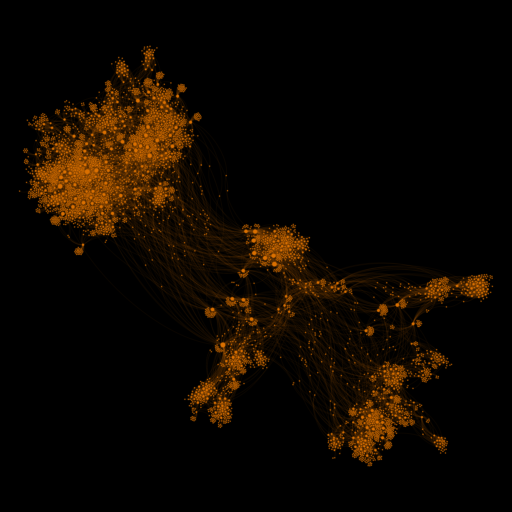

# ipbw

interplanetary black widow crawls ur ipfs and filecoin nodes

This package reimplements portions of [`go-libp2p-kad-dht`](https://github.com/libp2p/go-libp2p-kad-dht) to optimize for peer discovery while crawling the DHT.

## Usage

```
NAME:
   Interplanetary Black Widow - crawls ur ipfs/filecoin nodes

USAGE:
   ipbw [global options] command [command options] [arguments...]

COMMANDS:
   help, h  Shows a list of commands or help for one command

GLOBAL OPTIONS:
   --duration NUM_MINUTES, -d NUM_MINUTES  Specify the NUM_MINUTES to run the crawler, or 0 for endless mode. (default: 0)
   --network NETWORK, -n NETWORK           Specify the NETWORK on which to run the crawler (filecoin / ipfs) (default: "ipfs")
   --help, -h                              show help (default: false)
```

## TODO

- Filter IPs to get rid of garbage
- Integrate graph library for nice visual output

## How does the DHT work?

(TODO)

Nodes are uniquely identified by their peer ID, which is a hash of the node's public key (TODO verify). When two nodes connect to each other, they provide a list of protocols they support. Some example protocol strings:
* `/ipfs/kad/1.0.0` - the default protocol string used by `go-libp2p-kad-dht`
* `/ipfs/id/1.0.0` - the "identity" protocol used by `go-libp2p` to exchange more detailed info about nodes

If both nodes support the DHT protocol, they will begin exchanging DHT messages. DHT messages are serialized versions of the following struct:
```go
type DHTMessage struct {
	Type          MessageType
	ClusterLevel  int32
	Key           string
	Record        *DHTRecord
	CloserPeers   []peer.AddrInfo
	ProviderPeers []peer.AddrInfo
}
```

Detail on each field:
* **Type**: What type of DHT message this is (0 - 5). More details below.
* **ClusterLevel**: No clue what this is used for.
* **Key**: Used to provide a key for certain message types
* **Record**: Used to provide key/value information for certain message types
* **CloserPeers**: Used to tell us about peers that may be able to answer our query better
* **ProviderPeers**: ??

There are 6 types of DHT message:
* 0: `PUT_VALUE`
* 1: `GET_VALUE`
* 2: `ADD_PROVIDER`
* 3: `GET_PROVIDERS`
* 4: `FIND_NODE`
* 5: `PING`

## Output

Last version's output is below. This version can swing 5000+ unique peers discovered in under a minute 😎

The output of a 10-minute crawl was rendered in Cytoscape using an edge-weighted, force-based layout algorithm. Some discovery statistics:
* 600 unique peers discovered within 1 minute
* 2450 unique peers discovered within 5 minutes
* 3600 unique peers discovered within 10 minutes


