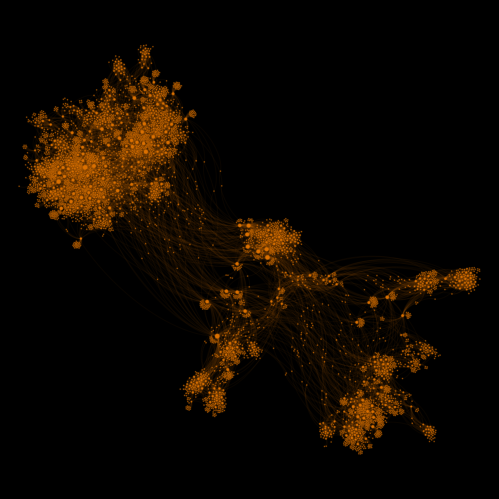

# ipbw

Interplanetary Black Widow - crawls ur IPFS nodes

## About

IPBW uses `go-libp2p` and `go-libp2p-kad-dht` to crawl the IPFS network. IPBW spawns workers to generate random peer IDs and execute DHT queries to connected peers. The DHT uses an XOR distance calculation to select up to K connected peers to query for each random peer ID. Peers respond with their own connected peers within a certain distance of the requested random peer ID. Over time, recursive queries to discovered peers enumerate the network.

## Usage

```
NAME:
   Interplanetary Black Widow - crawls ur IPFS nodes

USAGE:
   ipbw [global options] command [command options] [arguments...]

COMMANDS:
   help, h  Shows a list of commands or help for one command

GLOBAL OPTIONS:
   -c FILE           load config from FILE, ignoring any other set flags
   -d NUM_MINUTES    specify NUM_MINUTES to run the crawler. 0 will run in endless mode. (default: 0)
   -w value          specify the number of goroutines used to query the DHT (default: 8)
   -s, --status      specify whether the crawler should output occasional status updates to console. (default: false)
   -i, --identifier  enables the identifier module (default: false)
   -r, --reporter    enables the reporter module, which publishes results to a server (default: false)
   --help, -h        show help (default: false)
```

### Reading config from file

Instead of using CLI flags, the crawler can be configured via JSON file. To read from JSON, run the crawler like this:

`./ipbw -c example.json`

Here's an example config file:

```json
{
   "numWorkers": 8,
   "crawlDuration": 10, // Omit, or set to 0 for endless mode
   "modules": { // Modules are optional - omit any module to run without it
      "status": {
         "interval": 1 // As with the CLI flags, intervals describe a "number of minutes"
      },
      "reporter": {
         "interval": 1,
         "publishEndpoint": "http://127.0.0.1:8000/batch",
         "pingEndpoint": "http://127.0.0.1:8000/healthcheck",
         "apiKey": "EXAMPLE_KEY"
      },
      "identifier": {
         "interval": 1
      }
   }
}
```

## Output

The output of a 10-minute crawl was rendered in Cytoscape using an edge-weighted, force-based layout algorithm. Some discovery statistics:
* 600 unique peers discovered within 1 minute
* 2450 unique peers discovered within 5 minutes
* 3600 unique peers discovered within 10 minutes


